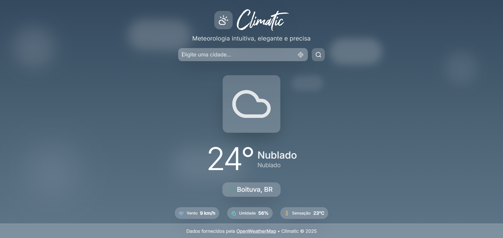

# 🌤️ Climatic

> Aplicação web moderna para consulta de clima em tempo real. Desenvolvida com Next.js 15 e React 19, oferece busca inteligente por cidade, detecção automática de localização e interface responsiva com backgrounds dinâmicos baseados nas condições climáticas.

Stack: Next.js 15, React 19, TypeScript, Tailwind CSS 4



## Sumário

- [Features](#features)
- [Quick Start](#quick-start)
- [API](#api)
- [Arquitetura](#arquitetura)
- [Sistema de Design UI](#sistema-de-design-ui)
- [Integrações](#integrações)
- [Atribuição (OpenWeather)](#atribuição-openweather)
- [Desenvolvimento](#desenvolvimento)
- [Troubleshooting](#troubleshooting)
- [Contribuições](#contribuições)
- [Licença](#licença)

## ✨ Features

- [x] Busca por cidade com autocomplete
- [x] Detecção automática por geolocalização
- [x] Backgrounds dinâmicos baseados no clima
- [x] UI responsiva e acessível com glassmorphism
- [x] Sistema de componentes UI reutilizáveis
- [x] Cache e persistência da última cidade
- [x] Notificações de erro com auto-close

## 🚀 Quick Start

Pré-requisitos:
- Node.js 18+ e npm (ou pnpm/yarn)
- Chave da API da OpenWeather (criada no site da OpenWeather)

```bash
# Clone e instale dependências do projeto
git clone https://github.com/[SEU_USUARIO]/climatic.git
cd climatic
npm install

# Configure a API key
# Crie um arquivo .env.local na raiz do projeto com o conteúdo:
# OPENWEATHER_API_KEY=sua_chave_aqui

# Execute em desenvolvimento
npm run dev
```

Abra http://localhost:3000

## � API

**Endpoints internos:**

- `GET /api/weather?city={NOME}` ou `GET /api/weather?lat={LAT}&lon={LON}`
  - Units: `metric` (Celsius), `lang=pt_br`
  - Exemplo: `/api/weather?city=São Paulo`

```json
{
  "city": "São Paulo",
  "country": "BR", 
  "temperature": 24,
  "condition": "Ensolarado",
  "description": "Céu limpo",
  "humidity": 65,
  "windSpeed": 12,
  "feelsLike": 23,
  "weatherIcon": "sunny"
}
```

- `GET /api/cities?q={TERMO}` — Autocomplete de cidades

## 🏗️ Arquitetura

```
src/
├─ app/                     # App Router (rotas, layout, estilos globais)
│  ├─ api/
│  │  ├─ cities/route.ts    # Autocomplete de cidades (OpenWeather Geocoding)
│  │  └─ weather/route.ts   # Clima atual (OpenWeather Current Weather)
│  ├─ favicon.ico           # Ícone da aplicação
│  ├─ globals.css           # Estilos globais
│  ├─ layout.tsx            # Metadata, fontes e layout raiz
│  └─ page.tsx              # Página inicial
│
├─ components/
│  └─ weather/
│     ├─ index.ts           # Barrel export (import único)
│     ├─ containers/        # Componentes principais (páginas/seções)
│     │  ├─ WeatherHeader.tsx
│     │  ├─ WeatherHero.tsx
│     │  └─ WeatherDetails.tsx
│     ├─ search/            # Busca e autocomplete
│     │  ├─ SearchBar.tsx
│     │  ├─ SuggestionsList.tsx
│     │  └─ ErrorDisplay.tsx
│     ├─ layout/            # Layout/estrutura visual
│     │  ├─ DynamicBackground.tsx
│     │  └─ StaticHeaderContent.tsx
│     └─ ui/                # Sistema de Design UI reutilizável
│        ├─ Button.tsx      
│        ├─ Card.tsx        
│        ├─ ErrorAlert.tsx  
│        ├─ Spinner.tsx     
│        ├─ WeatherIcon.tsx 
│        ├─ WeatherSkeleton.tsx
│        └─ index.ts        # Barrel export dos componentes UI
│
├─ hooks/                   # Hooks de estado/efeitos
│  ├─ useDebounce.ts
│  ├─ useTime.ts
│  └─ useWeather.ts
│
├─ lib/                     # Utilitários, constantes
│  ├─ constants.ts          # Tempos de cache, mensagens, chaves de storage, etc.
│  ├─ gradient.ts
│  └─ utils.ts
│
├─ services/
│  └─ WeatherService.ts     # Integração com OpenWeather (mapeia payload -> WeatherData)
│
└─ types/                   # Tipos TypeScript compartilhados
   └─ weather.ts            # Interfaces e tipos do domínio de clima
```

Import único via barrel (mais limpo):

```ts
import { WeatherHeader, WeatherHero, WeatherDetails, DynamicBackground, WeatherSkeleton } from '@/components/weather';

// Ou importar componentes UI diretamente:
import { Button, Card, ErrorAlert, Spinner, WeatherIcon } from '@/components/weather/ui';
```

## 🎨 Sistema de Design UI

Componentes reutilizáveis com design glassmorphism para consistência visual:

- **Button**: 3 variantes (`primary`, `secondary`, `ghost`) e 3 tamanhos
- **Card**: Containers com backdrop-blur para efeito vidro
- **ErrorAlert**: Sistema de notificações com 4 tipos e auto-close
- **Spinner**: Indicadores de carregamento em 3 tamanhos
- **WeatherIcon**: Ícones padronizados para condições climáticas

```tsx
// Exemplo de uso
<Card variant="glass" padding="md">
  <Button variant="primary" loading={isLoading}>
    Buscar Clima
  </Button>
</Card>

<ErrorAlert 
  message="Cidade não encontrada" 
  type="error" 
  autoClose={true} 
/>
```

##  Integrações

- OpenWeatherMap
    - Current Weather Data
    - Geocoding API

    - Observações:
        - A aplicação usa `units=metric` (°C) e `lang=pt_br`.
        - O serviço possui limites de requisição por plano (minuto/dia). Em caso de erro 429 (Too Many Requests), aguarde e tente novamente.
        - A chave `OPENWEATHER_API_KEY` deve ser configurada apenas no ambiente do servidor.

## 📑 Atribuição (OpenWeather)

Os dados de clima exibidos são fornecidos pela OpenWeather.

- Crédito: “Dados fornecidos por OpenWeatherMap” com link para https://openweathermap.org/
- Licenças relacionadas (conforme documentação da OpenWeather):
    - CC BY-SA 4.0: https://creativecommons.org/licenses/by-sa/4.0/
    - ODbL: https://opendatacommons.org/licenses/odbl/
- Indicação de processamento: as respostas podem ser traduzidas antes de exibição.

## �️ Desenvolvimento

### Performance & Otimizações

- **Cache (ISR)**: Requisições de clima têm revalidação configurável (5min default)
- **Debounce**: Busca de cidades usa delay de 300ms para evitar spam
- **Persistência**: Última cidade consultada salva no localStorage
- **Componentes UI**: Sistema modular para reutilização e manutenção
- **TypeScript**: Tipagem completa em todos os componentes UI

### Segurança

- **API Key**: Lida apenas no servidor, não exposta no cliente
- **Headers**: Configurados em `next.config.ts` (XSS, CSRF, content sniffing)
- **Sanitização**: Todos os inputs são tratados com `encodeURIComponent`

### Configurações

Constantes centralizadas em `src/lib/constants.ts`:
- `WEATHER_CACHE_TIME`, `CITY_SEARCH_MIN_LENGTH`, `DEBOUNCE_DELAY`, etc.

## 🛠️ Troubleshooting

**Build Issues:**
- Erro de módulo `critters`: Não use `experimental.optimizeCss` no `next.config.ts`
- Aviso ESLint (rushstack patch): Não quebra o build, pode rodar `npm run lint` separadamente

**API Issues:**
- 404 (City not found): Verifique o nome da cidade ou coordenadas
- 429 (Rate limit): Aguarde alguns minutos antes de tentar novamente
- 401 (Unauthorized): Verifique se `OPENWEATHER_API_KEY` está configurada

## 🤝 Contribuições

Sinta-se à vontade para contribuir! Basta abrir uma Issue ou enviar um Pull Request. Toda ajuda é bem-vinda!

### 💡 Ideias para Melhorias

- UI/UX
  - Adicionar temas escuro/claro
  - Melhorar animações de loading
  - Implementar visualização em mapa
  - Adicionar previsão para próximos dias

- Features
  - Salvar múltiplas cidades favoritas
  - Alertas de condições climáticas
  - Compartilhamento via redes sociais
  - Widgets para desktop/mobile

- Técnicas
  - Melhorar cache e performance
  - Expandir testes automatizados
  - Adicionar PWA (offline mode)
  - Integrar mais APIs meteorológicas

## 📄 Licença

Este projeto está licenciado sob a MIT License. Veja o arquivo `LICENSE` para detalhes.

—

Feito com Next.js e OpenWeatherMap.
